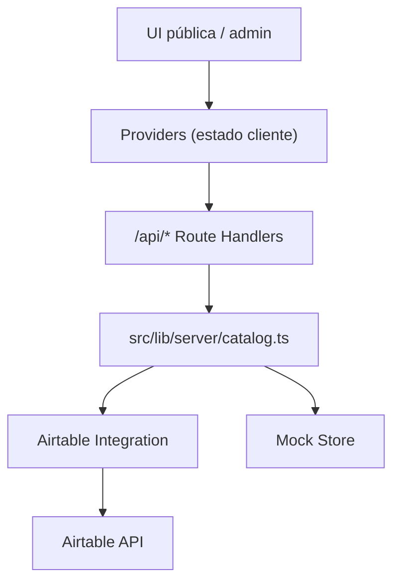

# Documentación Técnica del Proyecto

## 1. Resumen ejecutivo

Este repositorio contiene una aplicación web comercial desarrollada con **Next.js App Router**, **TypeScript** y **Tailwind CSS** para mostrar:

- loteos y lotes disponibles,
- propiedades en alquiler o venta,
- formularios de contacto y captación de leads,
- un panel admin mock para operación comercial,
- una capa opcional de integración server-side con Airtable.

En la rama actual, el proyecto está orientado a una **demo genérica y reutilizable** para presentar a distintos clientes del rubro inmobiliario. El branding visible ya no está atado a un caso puntual y se centraliza en una configuración común.

La aplicación está diseñada con una regla central:

> si Airtable no está disponible, la UI debe seguir funcionando completa con mocks locales.

---

## 2. Objetivo funcional del producto

El sistema busca resolver tres necesidades comerciales:

1. **Mostrar oferta inmobiliaria con lectura rápida**
   - loteos y lotes con estado, superficie, precio y financiación,
   - propiedades con ficha resumida, precio opcional y contacto inmediato.

2. **Captar interesados**
   - formularios de consulta,
   - CTA a WhatsApp,
   - alertas para oportunidades similares.

3. **Simular operación interna**
   - dashboard de lotes,
   - dashboard de propiedades,
   - actualización visual de estados y condiciones comerciales,
   - integración futura con Airtable.

---

## 3. Stack y runtime

### Frontend

- **Next.js 16.1.6**
- **React 19.2.4**
- **TypeScript 5.9**
- **Tailwind CSS 4**

### QA y tooling

- **ESLint**
- **Playwright**

### Runtime y estrategia de ejecución

- Desarrollo local: `next dev --webpack`
- Build local: `next build --webpack`
- SSR / route handlers: gestionados por Next.js App Router

### Motivo del uso de `--webpack`

El proyecto usa `--webpack` tanto en `dev` como en `build` porque en este entorno Windows + OneDrive hubo problemas recurrentes con Turbopack y procesos del cache de `.next`.

Scripts actuales en [package.json](/C:/Users/santi/OneDrive/Documentos/Inmobiliaria/package.json):

- `npm run dev`
- `npm run dev:turbo`
- `npm run clean:next`
- `npm run build`
- `npm run start`
- `npm run lint`
- `npm run qa:ui`
- `npm run qa:shots`
- `npm run qa:report`

---

## 4. Arquitectura general

La aplicación sigue una arquitectura liviana en capas:

1. **Capa de presentación**
   - componentes React para páginas públicas y admin,
   - consumo del estado global hidratado por el layout raíz.

2. **Capa de estado cliente**
   - contexto global en `Providers`,
   - actualizaciones optimistas para leads, lotes y propiedades,
   - toasts y feedback de UI.

3. **Capa de catálogo server-side**
   - centraliza la carga y mutación de datos,
   - decide si usar Airtable o mocks,
   - encapsula fallback y manejo de errores.

4. **Capa de integración externa**
   - cliente Airtable,
   - mappers y schemas de conexión,
   - almacenamiento de configuración cifrada para el wizard.

5. **Capa de mocks persistidos en memoria**
   - estado local del servidor para demo,
   - permite simular altas, bajas y ediciones sin backend real.

### Diagrama de alto nivel



---

## 5. Estructura del proyecto

### Directorios principales

```text
src/
  app/
    api/
    admin/
    contacto/
    loteos/
    propiedades/
    layout.tsx
    page.tsx
  components/
  data/
  lib/
    airtable/
    server/
  types/
tests/
  visual/
scripts/
```

### Archivos relevantes

- [src/app/layout.tsx](/C:/Users/santi/OneDrive/Documentos/Inmobiliaria/src/app/layout.tsx)
  Layout raíz. Carga bootstrap de datos server-side y monta `Providers`, `Navbar` y `Footer`.

- [src/components/providers.tsx](/C:/Users/santi/OneDrive/Documentos/Inmobiliaria/src/components/providers.tsx)
  Estado cliente compartido para desarrollos, propiedades, leads, toasts y mutaciones optimistas.

- [src/lib/server/catalog.ts](/C:/Users/santi/OneDrive/Documentos/Inmobiliaria/src/lib/server/catalog.ts)
  Fachada principal de lectura/escritura. Decide si la fuente es Airtable o mocks.

- [src/lib/server/mock-store.ts](/C:/Users/santi/OneDrive/Documentos/Inmobiliaria/src/lib/server/mock-store.ts)
  Store en memoria para demo. Simula persistencia durante la sesión del proceso.

- [src/lib/server/airtable-integration.ts](/C:/Users/santi/OneDrive/Documentos/Inmobiliaria/src/lib/server/airtable-integration.ts)
  Orquestación de integración con Airtable, wizard, cifrado, preview y health tracking.

- [src/data/mock-data.ts](/C:/Users/santi/OneDrive/Documentos/Inmobiliaria/src/data/mock-data.ts)
  Fuente de datos mock inicial para loteos, lotes, propiedades y leads.

- [src/types/index.ts](/C:/Users/santi/OneDrive/Documentos/Inmobiliaria/src/types/index.ts)
  Tipos de dominio y contratos internos.

---

## 6. Branding y configuración de sitio

El branding visible se centraliza en [src/lib/site-config.ts](/C:/Users/santi/OneDrive/Documentos/Inmobiliaria/src/lib/site-config.ts).

Actualmente define:

- nombre de marca,
- nombre legal,
- monograma,
- tagline,
- descripción general,
- WhatsApp,
- email,
- dirección,
- textos introductorios para WhatsApp.

Esto evita hardcodear branding en múltiples componentes y facilita:

- clonar la demo para otros clientes,
- generar una futura versión white-label,
- cambiar identidad visual sin tocar lógica de negocio.

### Componentes que consumen esta config

- [src/app/layout.tsx](/C:/Users/santi/OneDrive/Documentos/Inmobiliaria/src/app/layout.tsx)
- [src/components/layout.tsx](/C:/Users/santi/OneDrive/Documentos/Inmobiliaria/src/components/layout.tsx)
- [src/components/contact-page.tsx](/C:/Users/santi/OneDrive/Documentos/Inmobiliaria/src/components/contact-page.tsx)
- [src/lib/whatsapp.ts](/C:/Users/santi/OneDrive/Documentos/Inmobiliaria/src/lib/whatsapp.ts)

---

## 7. Modelado de dominio

El dominio principal está tipado en [src/types/index.ts](/C:/Users/santi/OneDrive/Documentos/Inmobiliaria/src/types/index.ts).

### 7.1. Loteos y lotes

#### `Development`

Representa un loteo o desarrollo.

Campos principales:

- `id`
- `slug`
- `name`
- `location`
- `province`
- `shortDescription`
- `heroDescription`
- `generalStatus`
- `coverTheme`
- `baseCurrency`
- `amenities`
- `siteMap`
- `lots`

#### `Lot`

Representa un lote dentro de un loteo.

Campos principales:

- `lotCode`
- `number`
- `block`
- `street`
- `area`
- `orientation`
- `status`
- `price`
- `currency`
- `financing`
- `description`
- `notes`
- `mapPosition`

#### `LotStatus`

Valores soportados:

- `disponible`
- `reservado`
- `vendido`
- `consultado`

### 7.2. Propiedades

#### `Property`

Representa una casa, departamento o cabaña para alquiler o venta.

Campos principales:

- `id`
- `slug`
- `title`
- `type`
- `operation`
- `availability`
- `location`
- `province`
- `addressOrZone`
- `shortDescription`
- `description`
- `surfaceM2`
- `coveredM2`
- `bedrooms`
- `bathrooms`
- `parking`
- `price`
- `currency`
- `showPrice`
- `featured`
- `images`
- `whatsappMessage`

#### `PropertyType`

Valores internos:

- `casa`
- `departamento`
- `cabana`

Importante: internamente el valor técnico es `cabana`, pero la UI lo presenta como **Cabaña**.

#### `PropertyOperation`

- `alquiler`
- `venta`

#### `PropertyAvailability`

- `disponible`
- `reservada`
- `cerrada`
- `oculta`

En UI, `cerrada` se presenta de forma contextual como cerrada/vendida/alquilada según corresponda.

### 7.3. Leads

#### `Lead`

Modela una consulta comercial proveniente del sitio.

Campos relevantes:

- metadatos de lote (`developmentSlug`, `lotCode`, `lotLabel`)
- metadatos de propiedad (`propertyId`, `propertySlug`, `propertyLabel`)
- datos del contacto (`name`, `phone`, `email`, `message`)
- `source`
- `createdAt`
- `status`

#### `LeadSource`

- `lote`
- `contacto`
- `alerta`
- `propiedad`

### 7.4. Integración Airtable

Tipos relevantes:

- `AirtableConnectionSummary`
- `AirtableIntegrationConfig`
- `AirtableWizardSession`
- `AirtableTableMapping`
- `AirtableFieldMapping`
- `AirtablePreviewResult`

---

## 8. Flujo de arranque de la aplicación

El punto de entrada real del sitio está en [src/app/layout.tsx](/C:/Users/santi/OneDrive/Documentos/Inmobiliaria/src/app/layout.tsx).

### Secuencia

1. `RootLayout` ejecuta `loadAppBootstrapData()`.
2. `loadAppBootstrapData()` vive en [src/lib/server/catalog.ts](/C:/Users/santi/OneDrive/Documentos/Inmobiliaria/src/lib/server/catalog.ts).
3. Se cargan en paralelo:
   - desarrollos,
   - propiedades,
   - leads.
4. Los resultados se inyectan en `Providers`.
5. El resto de la app consume los datos desde `useAppData()`.

### Consecuencia arquitectónica

La UI pública no depende de fetchs iniciales desde el cliente para estar operativa. La primera carga ya viene hidratada desde el servidor.

Esto mejora:

- tiempo de primera renderización,
- estabilidad visual,
- coherencia entre SSR y cliente,
- reutilización del mismo catálogo en páginas y admin.

---

## 9. Estado cliente y Providers

La capa de estado cliente está en [src/components/providers.tsx](/C:/Users/santi/OneDrive/Documentos/Inmobiliaria/src/components/providers.tsx).

### Responsabilidades principales

- exponer datos globales:
  - `developments`
  - `properties`
  - `leads`

- exponer mutaciones:
  - `submitLead`
  - `updateLot`
  - `createProperty`
  - `updateProperty`
  - `deleteProperty`

- exponer utilidades:
  - `showToast`
  - `getDevelopmentBySlug`
  - `getPropertyBySlug`

### Estrategia de actualización

Las mutaciones usan una combinación de:

- **optimistic UI** en cliente,
- sincronización posterior con `/api/*`,
- rollback básico cuando falla la operación.

### Ejemplos

#### `submitLead`

- agrega el lead inmediatamente al estado local,
- si la consulta es de un lote disponible, lo pasa a `consultado`,
- después intenta sincronizar contra `/api/inquiries`.

#### `createProperty`

- crea una propiedad optimista con imágenes normalizadas,
- la agrega al estado local,
- luego intenta persistirla vía `/api/admin/properties`.

#### `updateProperty`

- aplica cambios optimistas,
- normaliza la galería,
- persiste vía `PATCH`,
- revierte si falla.

### Toasts

El provider monta una región global de toasts con autocierre.

---

## 10. Capa de catálogo server-side

La fachada principal vive en [src/lib/server/catalog.ts](/C:/Users/santi/OneDrive/Documentos/Inmobiliaria/src/lib/server/catalog.ts).

### Responsabilidad

Es el punto único de entrada para:

- leer desarrollos,
- leer lotes,
- leer leads,
- leer propiedades,
- crear consultas,
- modificar lotes,
- crear/editar/eliminar propiedades.

### Beneficio

La UI y las rutas API no necesitan saber si la fuente real es:

- Airtable,
- mocks locales,
- o fallback por error.

### Contrato de respuesta

La mayoría de las funciones devuelven:

- `data`
- `source`
- `fallback`

Esto permite saber si la respuesta vino de:

- `airtable`
- `mock`

y si hubo fallback por error.

### Precedencia de fuente de datos

Para **desarrollos, lotes y leads**:

1. conexión Airtable guardada y activa,
2. configuración Airtable por variables de entorno,
3. mocks locales.

Para **propiedades**:

- hoy el catálogo sigue siendo **mock-only**.

Esto es importante: la arquitectura ya está preparada para Airtable, pero la vertical de propiedades todavía no sale desde esa integración.

---

## 11. Mock store y persistencia de demo

La persistencia mock vive en [src/lib/server/mock-store.ts](/C:/Users/santi/OneDrive/Documentos/Inmobiliaria/src/lib/server/mock-store.ts).

### Características

- usa `structuredClone`,
- mantiene estado en memoria del proceso Node,
- no persiste en base de datos,
- se reinicia cuando reinicia el proceso del servidor.

### Entidades gestionadas

- `developmentsState`
- `leadsState`
- `propertiesState`

### Operaciones soportadas

- obtener desarrollos
- obtener lotes
- obtener leads
- obtener propiedades
- crear lead
- crear propiedad
- actualizar propiedad
- eliminar propiedad
- actualizar lote

### Limitación importante

Este store sirve para la demo y para mostrar comportamiento “realista”, pero:

- no es persistencia durable,
- no soporta múltiples instancias,
- no debe considerarse backend final.

---

## 12. Integración con Airtable

### Estado actual

La integración existe a nivel técnico, pero está **oculta/deshabilitada por feature flag** en la primera demo.

Feature flag actual en [src/lib/features.ts](/C:/Users/santi/OneDrive/Documentos/Inmobiliaria/src/lib/features.ts):

- `NEXT_PUBLIC_ENABLE_AIRTABLE_INTEGRATION === 'true'`

Por defecto, en [.env.local.example](/C:/Users/santi/OneDrive/Documentos/Inmobiliaria/.env.local.example), esta funcionalidad está en `false`.

### Archivos principales

- [src/lib/airtable/client.ts](/C:/Users/santi/OneDrive/Documentos/Inmobiliaria/src/lib/airtable/client.ts)
- [src/lib/airtable/mappers.ts](/C:/Users/santi/OneDrive/Documentos/Inmobiliaria/src/lib/airtable/mappers.ts)
- [src/lib/airtable/connection-schema.ts](/C:/Users/santi/OneDrive/Documentos/Inmobiliaria/src/lib/airtable/connection-schema.ts)
- [src/lib/server/airtable-integration.ts](/C:/Users/santi/OneDrive/Documentos/Inmobiliaria/src/lib/server/airtable-integration.ts)

### Qué resuelve

- validación de PAT,
- listado de bases,
- lectura del schema,
- mapping de tablas,
- mapping de campos,
- preview real/demostrativo,
- guardado cifrado de la conexión,
- fallback automático a mocks.

### Seguridad de la integración

- el token nunca se expone al frontend de forma persistente,
- se cifra con **AES-256-GCM**,
- la clave puede venir por env o guardarse server-side en `.data`,
- si no hay persistencia en disco, cae a memoria temporal,
- la UI sólo ve un token enmascarado.

### Persistencia de la conexión

Archivos usados por la capa:

- `.data/airtable-integration.json`
- `.data/airtable-integration.key`

### Modo demo

La capa también soporta un modo `demo`, útil para probar el wizard sin Airtable real.

---

## 13. Rutas públicas del sitio

### `/`

Archivo: [src/app/page.tsx](/C:/Users/santi/OneDrive/Documentos/Inmobiliaria/src/app/page.tsx)

Componente principal: [src/components/home-page.tsx](/C:/Users/santi/OneDrive/Documentos/Inmobiliaria/src/components/home-page.tsx)

Responsabilidad:

- hero principal,
- presentación comercial,
- resumen de loteos,
- resumen de propiedades,
- CTAs de contacto.

### `/loteos`

Archivo: [src/app/loteos/page.tsx](/C:/Users/santi/OneDrive/Documentos/Inmobiliaria/src/app/loteos/page.tsx)

Componente principal: [src/components/developments-page.tsx](/C:/Users/santi/OneDrive/Documentos/Inmobiliaria/src/components/developments-page.tsx)

Responsabilidad:

- listado de desarrollos,
- filtros y navegación comercial,
- acceso al detalle de cada loteo.

### `/loteos/[slug]`

Archivo: [src/app/loteos/[slug]/page.tsx](/C:/Users/santi/OneDrive/Documentos/Inmobiliaria/src/app/loteos/[slug]/page.tsx)

Componente principal: [src/components/development-detail-page.tsx](/C:/Users/santi/OneDrive/Documentos/Inmobiliaria/src/components/development-detail-page.tsx)

Responsabilidad:

- detalle del loteo,
- vista mapa/lista,
- selección de lotes,
- detalle de lote en modal/bottom sheet,
- CTA de consulta y WhatsApp.

### `/propiedades`

Archivo: [src/app/propiedades/page.tsx](/C:/Users/santi/OneDrive/Documentos/Inmobiliaria/src/app/propiedades/page.tsx)

Componente principal: [src/components/properties-page.tsx](/C:/Users/santi/OneDrive/Documentos/Inmobiliaria/src/components/properties-page.tsx)

Responsabilidad:

- grilla de propiedades,
- filtros por operación, tipo y ubicación,
- quick view modal,
- CTA de WhatsApp,
- formulario de consulta.

### `/contacto`

Archivo: [src/app/contacto/page.tsx](/C:/Users/santi/OneDrive/Documentos/Inmobiliaria/src/app/contacto/page.tsx)

Componente principal: [src/components/contact-page.tsx](/C:/Users/santi/OneDrive/Documentos/Inmobiliaria/src/components/contact-page.tsx)

Responsabilidad:

- canal institucional de contacto,
- formulario general,
- datos de marca,
- CTA de WhatsApp.

### `/admin`

Archivo: [src/app/admin/page.tsx](/C:/Users/santi/OneDrive/Documentos/Inmobiliaria/src/app/admin/page.tsx)

Componente principal: [src/components/admin-page.tsx](/C:/Users/santi/OneDrive/Documentos/Inmobiliaria/src/components/admin-page.tsx)

Responsabilidad:

- dashboard de lotes,
- dashboard de propiedades,
- tabla de leads,
- actualización mock de condiciones comerciales,
- futura integración con Airtable.

---

## 14. Componentes principales de UI

### Layout y shell

- [src/components/layout.tsx](/C:/Users/santi/OneDrive/Documentos/Inmobiliaria/src/components/layout.tsx)
  - `Navbar`
  - `Footer`

### Loteos y lotes

- [src/components/loteos-ui.tsx](/C:/Users/santi/OneDrive/Documentos/Inmobiliaria/src/components/loteos-ui.tsx)
- [src/components/development-detail-page.tsx](/C:/Users/santi/OneDrive/Documentos/Inmobiliaria/src/components/development-detail-page.tsx)
- [src/components/lot-interactions.tsx](/C:/Users/santi/OneDrive/Documentos/Inmobiliaria/src/components/lot-interactions.tsx)

Piezas destacadas:

- `SitePlanMap`
- `LotDetailSheet`
- `InquiryForm`

### Propiedades

- [src/components/properties-page.tsx](/C:/Users/santi/OneDrive/Documentos/Inmobiliaria/src/components/properties-page.tsx)
- [src/components/properties-ui.tsx](/C:/Users/santi/OneDrive/Documentos/Inmobiliaria/src/components/properties-ui.tsx)

Piezas destacadas:

- `PropertyFilters`
- `PropertyCard`
- `PropertyQuickViewModal`
- badges de operación y estado

### Admin

- [src/components/admin-page.tsx](/C:/Users/santi/OneDrive/Documentos/Inmobiliaria/src/components/admin-page.tsx)
- [src/components/admin-ui.tsx](/C:/Users/santi/OneDrive/Documentos/Inmobiliaria/src/components/admin-ui.tsx)
- [src/components/admin-properties.tsx](/C:/Users/santi/OneDrive/Documentos/Inmobiliaria/src/components/admin-properties.tsx)
- [src/components/admin-airtable.tsx](/C:/Users/santi/OneDrive/Documentos/Inmobiliaria/src/components/admin-airtable.tsx)

---

## 15. Mapa interactivo de loteos

La interacción principal de loteos vive en [src/components/lot-interactions.tsx](/C:/Users/santi/OneDrive/Documentos/Inmobiliaria/src/components/lot-interactions.tsx).

### `SitePlanMap`

Responsabilidades:

- renderizar el plano a través de SVG,
- dibujar elementos comunes del loteo,
- dibujar cada lote con color por estado,
- permitir selección por click/tap/teclado,
- mostrar leyenda y contadores por estado.

### Responsive

El componente usa:

- contenedor con `aspect-ratio`,
- `ResizeObserver` para detectar compactación,
- control de `touchAction`,
- variantes de tipografía según ancho.

Esto resuelve problemas típicos de mobile:

- colapso de altura,
- overflow horizontal,
- targets difíciles de tocar,
- texto ilegible sobre el SVG.

### Estados visuales

Los colores y labels se centralizan en [src/lib/format.ts](/C:/Users/santi/OneDrive/Documentos/Inmobiliaria/src/lib/format.ts).

---

## 16. Modal de propiedad y flujo comercial

El modal principal de propiedades vive en [src/components/properties-ui.tsx](/C:/Users/santi/OneDrive/Documentos/Inmobiliaria/src/components/properties-ui.tsx).

### `PropertyQuickViewModal`

Responsabilidades:

- bloquear scroll de fondo,
- mostrar galería con miniaturas,
- resumir atributos clave,
- mostrar precio o “Consultar valor”,
- ofrecer dos acciones principales:
  - `Contactar por WhatsApp`
  - `Solicitar contacto`

### Integración con formulario

El formulario reutilizado es `InquiryForm`, compartido con lotes.

En propiedades:

- la acción primaria abre WhatsApp,
- la secundaria hace scroll interno al formulario,
- el botón de WhatsApp del formulario puede ocultarse con `showWhatsAppButton={false}`.

### Ventaja de UX

Esto evita duplicar componentes de contacto y mantiene un flujo comercial uniforme en todo el producto.

---

## 17. Dashboard admin

El admin es un **mock visual con comportamiento funcional local**, no un backoffice definitivo.

### Tabs

Gestionadas en [src/components/admin-page.tsx](/C:/Users/santi/OneDrive/Documentos/Inmobiliaria/src/components/admin-page.tsx):

- `Lotes`
- `Propiedades`
- `Integraciones` (solo si la feature flag está activa)

### Dashboard de lotes

Incluye:

- métricas de disponibilidad,
- edición visual de estado,
- edición de precio,
- edición de anticipo,
- edición de cuotas,
- tabla de leads de lotes y alertas.

### Dashboard de propiedades

Incluye:

- métricas por operación y disponibilidad,
- listado/tabla de propiedades,
- alta,
- edición,
- baja,
- carga mock de imágenes,
- leads de propiedades.

### Carga de imágenes

Las imágenes de propiedades en admin:

- se cargan vía `input[type=file]`,
- se convierten a `data URL`,
- se previsualizan en el cliente,
- se validan del lado servidor antes de persistirse en el mock store.

No existe todavía:

- storage externo,
- bucket S3,
- CDN,
- procesamiento real de imágenes.

---

## 18. API pública y administrativa

Todas las rutas viven en `src/app/api/*`.

### 18.1. Catálogo público

#### `GET /api/developments`

Archivo: [src/app/api/developments/route.ts](/C:/Users/santi/OneDrive/Documentos/Inmobiliaria/src/app/api/developments/route.ts)

Devuelve:

- lista de desarrollos,
- `meta.source`
- `meta.fallback`

#### `GET /api/developments/[slug]`

Archivo: [src/app/api/developments/[slug]/route.ts](/C:/Users/santi/OneDrive/Documentos/Inmobiliaria/src/app/api/developments/[slug]/route.ts)

Devuelve:

- un desarrollo por slug,
- `404` si no existe.

#### `GET /api/lots`

Archivo: [src/app/api/lots/route.ts](/C:/Users/santi/OneDrive/Documentos/Inmobiliaria/src/app/api/lots/route.ts)

Soporta query:

- `development=<slug>`

#### `GET /api/lots/[lotCode]`

Archivo: [src/app/api/lots/[lotCode]/route.ts](/C:/Users/santi/OneDrive/Documentos/Inmobiliaria/src/app/api/lots/[lotCode]/route.ts)

Devuelve un lote puntual.

#### `GET /api/properties`

Archivo: [src/app/api/properties/route.ts](/C:/Users/santi/OneDrive/Documentos/Inmobiliaria/src/app/api/properties/route.ts)

Devuelve solo propiedades visibles:

- excluye `availability === 'oculta'`.

### 18.2. Captación de leads

#### `POST /api/inquiries`

Archivo: [src/app/api/inquiries/route.ts](/C:/Users/santi/OneDrive/Documentos/Inmobiliaria/src/app/api/inquiries/route.ts)

Responsabilidades:

- validar origen,
- rate limit,
- honeypot,
- cooldown mínimo,
- normalización de nombre/teléfono/email,
- generación de mensaje default si falta,
- persistencia vía catálogo.

Fuentes aceptadas:

- `lote`
- `contacto`
- `alerta`
- `propiedad`

### 18.3. Admin de lotes

#### `PATCH /api/admin/lots/[lotCode]`

Archivo: [src/app/api/admin/lots/[lotCode]/route.ts](/C:/Users/santi/OneDrive/Documentos/Inmobiliaria/src/app/api/admin/lots/[lotCode]/route.ts)

Permite editar:

- `status`
- `price`
- `downPayment`
- `installmentsCount`
- `installmentValue`
- `notes`

### 18.4. Admin de propiedades

#### `POST /api/admin/properties`

Archivo: [src/app/api/admin/properties/route.ts](/C:/Users/santi/OneDrive/Documentos/Inmobiliaria/src/app/api/admin/properties/route.ts)

#### `PATCH /api/admin/properties/[propertyId]`

Archivo: [src/app/api/admin/properties/[propertyId]/route.ts](/C:/Users/santi/OneDrive/Documentos/Inmobiliaria/src/app/api/admin/properties/[propertyId]/route.ts)

#### `DELETE /api/admin/properties/[propertyId]`

Archivo: [src/app/api/admin/properties/[propertyId]/route.ts](/C:/Users/santi/OneDrive/Documentos/Inmobiliaria/src/app/api/admin/properties/[propertyId]/route.ts)

### 18.5. Integración Airtable

Rutas disponibles:

- `POST /api/admin/integrations/airtable/validate-token`
- `GET /api/admin/integrations/airtable/bases`
- `GET /api/admin/integrations/airtable/schema`
- `POST /api/admin/integrations/airtable/test-mapping`
- `GET /api/admin/integrations/airtable/connection`
- `POST /api/admin/integrations/airtable/connection`
- `DELETE /api/admin/integrations/airtable/connection`

Hoy, si la feature está apagada, estas rutas responden `404` con un mensaje amigable.

---

## 19. Validación y sanitización de propiedades

La validación del payload de propiedades se centraliza en [src/lib/server/property-payload.ts](/C:/Users/santi/OneDrive/Documentos/Inmobiliaria/src/lib/server/property-payload.ts).

### Reglas destacadas

- tipos de propiedad permitidos,
- operaciones permitidas,
- disponibilidades permitidas,
- monedas permitidas,
- máximo de imágenes: `6`,
- longitud máxima por imagen: `1_500_000`,
- URLs válidas:
  - `data:image/...`
  - `https://...`
  - `http://...`

### Validaciones funcionales

Para crear una propiedad exige:

- título,
- ubicación,
- provincia,
- zona/dirección comercial,
- descripción corta,
- descripción completa,
- superficie,
- al menos una imagen.

### Normalización de imágenes

- si ninguna imagen está marcada como portada, la primera pasa a ser portada,
- se normaliza `alt`,
- se asignan IDs si faltan.

---

## 20. Seguridad

### 20.1. Headers HTTP

Definidos en [next.config.ts](/C:/Users/santi/OneDrive/Documentos/Inmobiliaria/next.config.ts).

Incluyen:

- `Content-Security-Policy`
- `X-Frame-Options: DENY`
- `X-Content-Type-Options: nosniff`
- `Referrer-Policy: strict-origin-when-cross-origin`
- `Permissions-Policy`
- `Cross-Origin-Opener-Policy`
- `Cross-Origin-Resource-Policy`
- `Origin-Agent-Cluster`

Además:

- `/admin` recibe `X-Robots-Tag: noindex, nofollow`

### 20.2. Origin check

La validación de origen se implementa en [src/lib/server/http.ts](/C:/Users/santi/OneDrive/Documentos/Inmobiliaria/src/lib/server/http.ts).

Se usa para:

- formularios públicos,
- endpoints mutantes,
- acciones admin.

### 20.3. Rate limiting

Implementado en:

- [src/lib/server/rate-limit.ts](/C:/Users/santi/OneDrive/Documentos/Inmobiliaria/src/lib/server/rate-limit.ts)
- [src/lib/server/http.ts](/C:/Users/santi/OneDrive/Documentos/Inmobiliaria/src/lib/server/http.ts)

Características:

- store en memoria global,
- clave por bucket + IP,
- ventanas temporales configurables,
- soporte para `Retry-After`.

### 20.4. Honeypot y cooldown

En `POST /api/inquiries`:

- campo honeypot `company`,
- validación de tiempo mínimo desde apertura del formulario (`startedAt`).

### 20.5. Token admin opcional

Si existe `ADMIN_API_TOKEN`, los endpoints admin exigen:

`Authorization: Bearer <token>`

Si no existe, el admin sigue funcionando como mock sin autenticación real.

### 20.6. Secretos

No se exponen:

- tokens Airtable,
- claves de integración,
- variables de entorno sensibles.

---

## 21. Utilidades de formato y presentación

Archivo principal: [src/lib/format.ts](/C:/Users/santi/OneDrive/Documentos/Inmobiliaria/src/lib/format.ts)

Responsabilidades:

- formato de moneda,
- formato de superficie,
- mapeo de estados,
- labels humanizados,
- metadata visual para badges.

También es la capa que resuelve la diferencia entre:

- valores técnicos internos,
- texto visible en español para el usuario final.

---

## 22. QA visual y Playwright

La configuración principal está en [playwright.config.ts](/C:/Users/santi/OneDrive/Documentos/Inmobiliaria/playwright.config.ts).

### Qué incluye

- reporter HTML,
- screenshots en fallo,
- trace en primer retry,
- video retenido en fallo,
- proyecto desktop,
- proyecto mobile,
- levantado automático del dev server.

### Suite actual

Archivo principal: [tests/visual/app.spec.ts](/C:/Users/santi/OneDrive/Documentos/Inmobiliaria/tests/visual/app.spec.ts)

Escenarios cubiertos:

- home
- listado de loteos
- detalle de loteo
- apertura de detalle de lote
- admin
- smoke del wizard Airtable

### Baselines

Se guardan bajo `tests/visual/app.spec.ts-snapshots/`.

### Comandos

- `npm run qa:ui`
- `npm run qa:shots`
- `npm run qa:report`

### Observación importante

La suite Playwright todavía conserva referencias a:

- slugs antiguos de loteos,
- el wizard Airtable incluso cuando la feature está desactivada.

Por lo tanto, después de cambios grandes de branding o cuando se oculta Airtable, conviene revisar y refrescar esa suite.

---

## 23. Responsive y criterios de UI

El proyecto busca una estética:

- premium,
- clara,
- comercial,
- mobile-first,
- sin overflow horizontal.

Se trabajó especialmente en:

- navbar,
- cards,
- mapa SVG,
- modales,
- admin tables,
- filtros.

### Prácticas visibles

- `overflow-x-hidden` en layout raíz,
- `min-w-0` en contenedores críticos,
- grids con breakpoints claros,
- modales con `max-h` y scroll interno,
- SVG responsivo para el mapa,
- CTAs consistentes en altura.

---

## 24. Deploy y entorno

### Netlify

Existe un archivo [netlify.toml](/C:/Users/santi/OneDrive/Documentos/Inmobiliaria/netlify.toml) con una configuración mínima:

- build command: `npm run build`
- Node version: `22`

### README

El README del proyecto contiene una guía breve de deploy en Netlify.

Archivo: [README.md](/C:/Users/santi/OneDrive/Documentos/Inmobiliaria/README.md)

### Validación local recomendada

```bash
npm run lint
npm run build
```

### Variables de entorno

Referencia: [.env.local.example](/C:/Users/santi/OneDrive/Documentos/Inmobiliaria/.env.local.example)

Incluye:

- `NEXT_PUBLIC_ENABLE_AIRTABLE_INTEGRATION`
- `AIRTABLE_API_KEY`
- `AIRTABLE_BASE_ID`
- `AIRTABLE_DEVELOPMENTS_TABLE`
- `AIRTABLE_LOTS_TABLE`
- `AIRTABLE_INQUIRIES_TABLE`
- `AIRTABLE_TIMEOUT_MS`
- `AIRTABLE_INTEGRATION_SECRET`
- `ADMIN_API_TOKEN`

---

## 25. Convenciones de desarrollo

Las reglas operativas del repo están en [AGENTS.md](/C:/Users/santi/OneDrive/Documentos/Inmobiliaria/AGENTS.md).

Puntos relevantes:

- no conectar client components directo a Airtable,
- toda integración externa debe pasar por `src/lib/airtable/*` y `src/app/api/*`,
- mantener modelos tipados,
- preservar QA visual,
- mantener seguridad básica en endpoints mutantes,
- mantener funcionamiento completo con mocks si falla Airtable.

---

## 26. Limitaciones actuales

### 26.1. Persistencia real

- No hay base de datos propia.
- El admin sigue siendo mock.
- El mock store vive en memoria.

### 26.2. Propiedades todavía no salen desde Airtable

Aunque el sistema ya tiene una capa robusta de integración, hoy solo desarrollos/lotes/leads están preparados para ser cargados desde Airtable. La vertical de propiedades sigue siendo local/mock.

### 26.3. Integraciones ocultas

La UI del wizard Airtable existe, pero está apagada por flag para la demo pública.

### 26.4. QA visual pendiente de actualización fina

La suite Playwright no está 100% sincronizada con todos los cambios recientes de branding genérico y ocultamiento de integraciones.

### 26.5. Admin sin autenticación real

El admin puede endurecerse con `ADMIN_API_TOKEN`, pero todavía no existe:

- login,
- sesión,
- control de permisos por usuario.

---

## 27. Próximos pasos recomendados

### Corto plazo

1. actualizar Playwright para la rama genérica actual;
2. alinear README y configuración efectiva de deploy si cambia la estrategia de Netlify;
3. consolidar la documentación visual/funcional para demos comerciales.

### Mediano plazo

1. llevar propiedades a una fuente server-side real;
2. agregar autenticación real para admin;
3. persistir imágenes en storage externo;
4. agregar auditoría o historial de cambios comerciales.

### Largo plazo

1. convertir branding/config en una capa multi-cliente;
2. reemplazar mock store por base de datos;
3. unificar loteos, propiedades, leads e integraciones dentro de un backoffice productivo.

---

## 28. Checklist técnico rápido

### Si querés correr el proyecto

```bash
npm install
npm run dev
```

### Si querés validar calidad

```bash
npm run lint
npm run build
```

### Si querés revisar QA visual

```bash
npm run qa:ui
npm run qa:report
```

### Si querés activar Airtable a futuro

1. poner `NEXT_PUBLIC_ENABLE_AIRTABLE_INTEGRATION=true`
2. definir variables o usar wizard
3. probar conexión
4. verificar fallback y seguridad

---

## 29. Conclusión

El proyecto ya tiene una base sólida para una demo comercial avanzada:

- buena separación entre UI, catálogo, mocks e integración externa,
- fallback robusto a datos locales,
- componentes reutilizables,
- panel admin mock con operaciones reales simuladas,
- base lista para crecer hacia un sistema productivo.

La arquitectura actual favorece una evolución incremental: se puede mejorar persistencia, auth o integraciones sin rehacer toda la aplicación.
